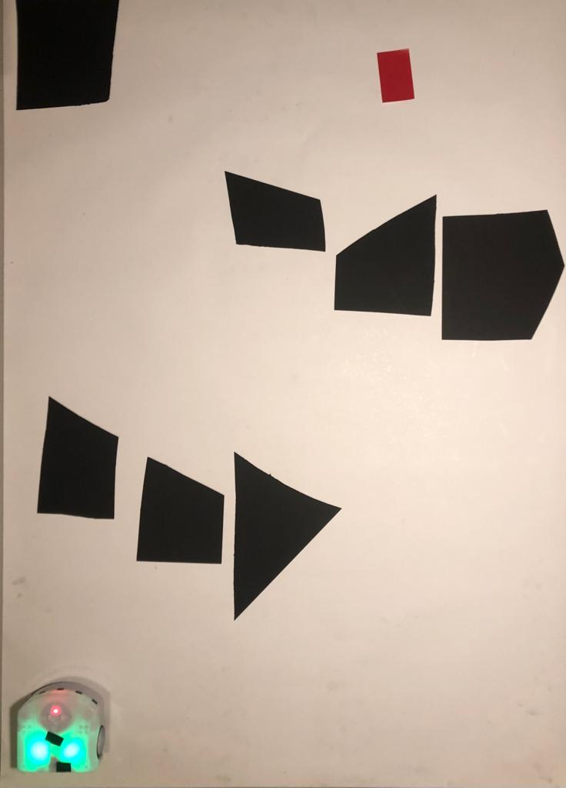
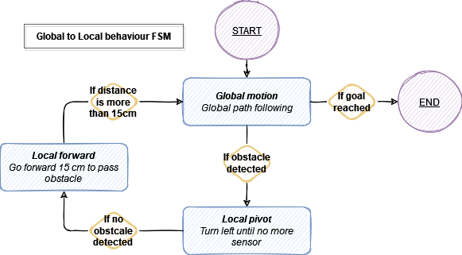
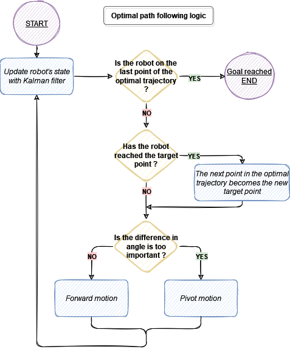
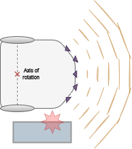
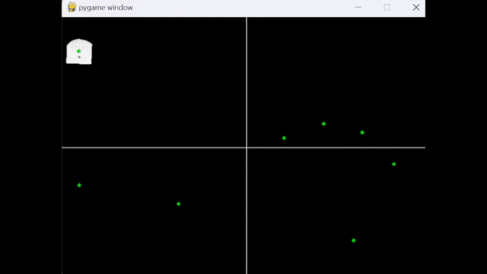

# Hot-Wheels - Thymio Path Finder Project (Mobile Robotics) 
##### _The best vision based path findind program for Thymio_
***

## Abstract
<div style="text-align: justify"> This project is part of the course Basics of mobile robotics (ME-452). The goal is to create a software enabling the Thymio to find its path through a set of obstacles. To this end, it will need to localize itself as well as its environment, and find the best path to the goal to then drive to it. Another challenge is for it to avoid any unexpected object it meets. This project is thus split in four distinct modules, plus the main file. Those four modules are: </div>

- <b>Vision</b>, camera based function and transformation for position, goal and terrain exctraction
- <b>Kalman Filter</b>, sensor fusion for accurate odometry computation
- <b>Optimal path algorithm</b>, path optimization using Dijkstra
- <b>Motion control</b>, in charge of the Thymio's motion and local avoidance

The choice for our environment was intended to be the easiest to detect for the camera, and therefore the most robust. The obstacles are random geometrical black forms, and the goal is a red rectangle. For the Thymio's position to be always detectable and more robust to changes in brightness, its LEDs were activated.

<p align="center">

</p>

## Table of contents
1. [Vision](#1-vision)
    - [Visibility graph](#11-visibility-graph)
    - [Thymio pose](#12-thymio-pose)
    - [Goal position](#13-goal-position)
    - [Visual feedback](#14-visual-feedback)
2. [Kalman Filter](#2-kalman-filter)
    - [Sensor estimation](#21-sensor-estimation)
    - [Position Kalman Filter](#22-position-kalman-filter)
    - [Orientation kalman filter](#23-orientation-kalman-filter)
    - [Kalman filter update squence](#24-kalman-filter-update-sequence)
3. [Optimal path algorithm](#3-optimal-path-algorithm)
4. [Motion control](#4-motion-control)
    - [Thymio's bivalent behavior](#41-thymios-bivalent-behavior)
    - [Global path following](#42-global-path-following)
    - [Local avoidance](#local-avoidance)
5. [Demo](#5-Demo)

## 1. Vision

<div style="text-align: justify"> This module includes functions converting the information percieved by the camera into a map, a goal and the current position of the robot. To this end, the image obtained from the camera is first filtered using a median filter, useful to remove the noise while preserving clear edges.<br>

### Visibility graph

The obstacles are represented by black shapes. In order to fetch the map, function <b>terrainFetch</b> computing the visibility graph is called. Pixel segmentation extracts the black geometrical obstacles, followed by a blob analysis only conserving blobs of a certain size (filtering leftover noise). Those blobs are then dilated to account for the robot's size, and all the blobs' corners are fetched. 

In order the find the dilated blobs' corners, function <b>cornerHarris</b> from the OpenCV library is called. This function filters the image using a Gaussian filter to smooth out any noise. The gradient of the image is then calculated in both x and y directions using a Sobel filter. The gradient values are then used to compute a "cornerness" matrix measuring the strength of the corner for each pixel in the image. The matrix is thresholded to select only the strongest corners in the image, and finally the coordinates of the identified corners are returned as an array (nodes).

The start and end point (i.e. start position of the robot and goal position) are also fetched (using functions detailed bellow), and added to the previous nodes (i.e. corners of the dilated blobs). To check weither the nodes are connected, each node is iterating over all the node, checking wether it has a direct connection (without intersecting a dilated blobs). This function returns the position of the nodes in meters, their connections, and the dilated obstacles' mask (displayed in the visual interface).<br>

### Thymio pose

Function <b>poseFetch</b> fetches the robots' position and angle thanks to the Thymio's red (angle) and green (position & angle) LEDs. The position is computed by first running a pixel segmentation and blob analysis to only keep the two green blobs. The center of those two blobs is found and the middle between those two points is defined to be the position of the robot. The center of the red blob is obtained with the same transformations (this time for one blob only), and the angle of the robot is resolved when comparing the two center found (center of the red blob, and center of the two green blobs) with respect to the X axis (i.e. using the arctan). The position of the robot is returned in pixel since this function is used in <b>terrainFetch</b>, but the position in meter is returned by the function <b>fetchOdoMeters</b>, calling <b>odoFetch</b> multiple times and converting the result in meter.<br>

### Goal position

The goal represented by a red square piece of paper is fetched with function <b>goalFetch</b>. It is retreived by performing the same transformation as done for the position : pixel segmentation followed by blob analysis to check the size of the blob and avoid noise. The goal is thus the center of the blob and is returned in meters.<br>

### Visual feedback

In order to get a visual feedback on what the algorithm outputs, function <b>liveFeedback</b> was created, it prints each node and their connections, the dilated obstacles, the robot's current position and angle, and the goal position.</div>


<p align="center">

</p>


## 2. Kalman Filter

The state of the Thymio is estimated using a Kalman filter. The choice for a kalman filter was made because we decided for the global navigation to use nodes described in a coordinate system with x and y coordinates. Thus, also the position of the Thymio should be estimated in that coordinate system. Since we have multiple sensor readings: vision and wheel encoder, the Kalman filter was selected to fuse these measurements.

For the purpose of estimating the state of the Thymio the linear dynamics are seperated from the rotational dynamics, hence two Kalman filters are used. Both are initialized using a vision measurement.

### 2.1 Sensor measurements

The Thymio itself has two sensor measurements (accelerometer and wheel encoder) available for odometry, and the use of an external camera gives a third one.
- $\boldsymbol{Vision}$

From the vision, the position coordinates as well as the orientation angle can be obtained and are used for the Kalman filters.

- $\boldsymbol{Wheel encoder}$

The wheel encoder provides information about the linear and angular velocity of the Thymio through the following equations:

$|\boldsymbol{v}| = \frac{w_l+w_r}{2}$
$\hspace{1cm}$
$v_x = |\boldsymbol{v}|cos(\theta)$
$\hspace{1cm}$
$v_y = |\boldsymbol{v}|sin(\theta)$

$\boldsymbol{\omega} = \frac{w_r-w_l}{l}$

where $w_l$ and $w_r$ are the left and right wheel speed measurements respectively and $l$ is the length between both wheels. $\theta$ is the orientation angle.

- $\boldsymbol{Accelerometer}$

It was decided to not use the accelerometer for odometry since the expected accelerations of the Thymio are in the range of $\pm0.5m/s^2$ while the accelerometer has a resolution of $0.46m/s^2$, hence it was concluded that the accelerometer would give no useful additional information.


### 2.2 Position Kalman Filter
The dynamic system used for the position estimation:

$$
\begin{bmatrix}
x_{k+1} \\ y_{k+1} \\ v_{x_{k+1}} \\ v_{y_{k+1}}
\end{bmatrix} =
\begin{bmatrix}
1 & 0 & T & 0 \\
0 & 1 & 0 & T \\
0 & 0 & 1 & 0 \\
0 & 0 & 0 & 1 \\
\end{bmatrix}
\begin{bmatrix}
x_{k} \\ y_{k} \\ v_{x_{k}} \\ v_{y_{k}}
\end{bmatrix} + 
\begin{bmatrix}
\frac{T^2}{2} & 0 \\
0 & \frac{T^2}{2} \\
T & 0 \\
0 & T \\
\end{bmatrix}\boldsymbol{w}_k
$$

$$
y_{1_k} = \begin{bmatrix}
1 & 0 & 0 & 0\\
0 & 1 & 0 & 0
\end{bmatrix}
\begin{bmatrix}
x_{k} \\ y_{k} \\ v_{x_{k}} \\ v_{y_{k}}
\end{bmatrix} + \boldsymbol{v}_{k_1}
$$

$$
y_{2_k} = \begin{bmatrix}
0 & 0 & 1 & 0\\
0 & 0 & 0 & 1
\end{bmatrix}
\begin{bmatrix}
x_{k} \\ y_{k} \\ v_{x_{k}} \\ v_{y_{k}}
\end{bmatrix} + \boldsymbol{v}_{k_2}
$$

The $x$ and $y$ position coordinates are in meters and the $v_x$ and $v_y$ velocities are in m/s. The output measurement $y_{1_k}$ consists of the position and represents the vision measurements. Output measurement $y_{2_k}$ consists of the velocity and represents the wheel encoder measurements from which the Thymio's linear velocity is determined. Following covariance matrices have been defines:

$$
W = 
\begin{bmatrix}
\frac{T^2}{2} & 0 \\
0 & \frac{T^2}{2} \\
T & 0 \\
0 & T \\
\end{bmatrix}
\begin{bmatrix}
\sigma_{acc}^2 & 0 \\ 
0 & \sigma_{acc}^2 \\
\end{bmatrix}
\begin{bmatrix}
\frac{T^2}{2} & 0 & T & 0 \\
0 & \frac{T^2}{2} & 0 & T
\end{bmatrix}
$$
$$
V_1 = 
\begin{bmatrix}
0.0001 & 0 \\
0 & 0.0001 \\
\end{bmatrix}
$$
$$
V_2 = 
\begin{bmatrix}
0.01 & 0 \\
0 & 0.01 \\
\end{bmatrix}
$$

The variance matrix $W$ corresponds to the process noise term $\boldsymbol{w}_k$ and the variance matrices $V_1$ and $V_2$ correspond to the output noise terms $\boldsymbol{v}_{k_1}$ and $\boldsymbol{v}_{k_2}$. The parameter $\sigma_{acc}$ represents the exptected standard deviation in linear acceleration. Since a constant velocity model is assumed, it accounts for model mismatch. $T$ is the time passed since the last estimate has been made.

The output covariance matrix $V_1$ was chosen to have 0.0001 on its diagonal since this corresponds to a standard deviation of 0.01m or an uncertainty of 1cm in the position measurement. The output covariance matrix $V_2$ was chose to have 0.01 on its diagonal since this corresponds to a standard deviation of 0.1m/s or an uncertainty of 10cm/s in the angular velocity measurement.


### 2.3 Orientation Kalman Filter
The dynamic system used for the orientation estimation:

$$
\begin{bmatrix}
\theta_{k+1} \\ \omega_{k+1}
\end{bmatrix} =
\begin{bmatrix}
1 & T \\
0 & 1 \\
\end{bmatrix}
\begin{bmatrix}
\theta_{k} \\ \omega_{k}
\end{bmatrix} + 
\begin{bmatrix}
\frac{T^2}{2} \\
T
\end{bmatrix}\boldsymbol{w}_k
$$

$$
y_{1_k} = \begin{bmatrix}
1 & 0 
\end{bmatrix}
\begin{bmatrix}
\theta_{k} \\ \omega_{k}
\end{bmatrix} + \boldsymbol{v}_{k_1}
$$

$$
y_{2_k} = \begin{bmatrix}
0 & 1
\end{bmatrix}
\begin{bmatrix}
\theta_{k} \\ \omega_{k}
\end{bmatrix} + \boldsymbol{v}_{k_2}
$$

The orientation angle $\theta$ is in radians and the angular velocity $\omega$ is in rad/s. The output measurement $y_{1_k}$ consists of the orientation and represents the vision measurements. Output measurement $y_{2_k}$ consists of the angular velocity and represents the wheel encoder measurements from which the Thymio's angular velocity is determined. Following covariance matrices have been defines:
$$
W = 
\begin{bmatrix}
\frac{T^2}{2} \\
 T \\
\end{bmatrix}
\begin{bmatrix}
\sigma_{acc}^2
\end{bmatrix}
\begin{bmatrix}
\frac{T^2}{2} & T
\end{bmatrix}
$$
$$
V_1 = 
\begin{bmatrix}
0.0001
\end{bmatrix}
$$
$$
V_2 = 
\begin{bmatrix}
0.01
\end{bmatrix}
$$


The variance matrix $W$ corresponds to the process noise term $\boldsymbol{w}_k$ and the variance matrices $V_1$ and $V_2$ correspond to the output noise terms $\boldsymbol{v}_{k_1}$ and $\boldsymbol{v}_{k_2}$. The parameter $\sigma_{acc}$ represents the exptected standard deviation in angular acceleration. Since a constant angular velocity model is assumed, it accounts for model mismatch. $T$ is the time passed since the last estimate has been made.

The output covariance matrix $V_1$ was chosen to have 0.0001 since this corresponds to a standard deviation of 0.01rad or an uncertainty of 0.57deg in the orientation measurement. The output covariance matrix $V_2$ was chose to have 0.01 since this corresponds to a standard deviation of 0.1rad/s or an uncertainty of 5.7deg/s in the velocity measurement.

### 2.4 Kalman filter update sequence
The estimate of Thymio's state is performed through the following sequence of calculations:
1. prediction step
- $\hat{x}_{k}^- = A\hat{x}_{k-1}^+$
- $P_k^- = AP_{k-1}^+A^T + W$

2. update step vision measurement (if available)
- $K_k = P_k^-C_{1}^T(C_1P_k^-C_1^T + V_1)^{-1}$
- $\hat{x}_k^+ = \hat{x}_k^- + K_k(y_{1_k}-C_{1}\hat{x}_k^-)$
- $P_k^+ = (I-K_kC_1)P_k^-$

3. update step wheel encoder (if available)
- $K_k = P_k^-C_{2}^T(C_1P_k^-C_2^T + V_2)^{-1}$
- $\hat{x}_k^+ = \hat{x}_k^- + K_k(y_{2_k}-C_{2}\hat{x}_k^-)$
- $P_k^+ = (I-K_kC_2)P_k^-$

There three step are executed at each timestep and are the same for the position as well as the orientation kalman filter.

## 3. Optimal Path Algorithm
<br/>
<div style="text-align: justify">
To find the optimal path for the robot, we decide to implement Dijkstra’s algorithm on our project. The vision module extract all coordinates of nodes and edges from obstacles.  This data is sent thanks to the function <b>terrainFetch</b>. We run this function until detect the map correctly. This step is done on the function <b>opt_path </b>. When it’s done, we run the Dijkstra algorithm with our function <b>dijkstra </b>. We have created node and edges classes in order to have a better readability.
<br/><br/>
In this function, we initialize a list of nodes and another one with edges. Note that we have to duplicate edges to have both ways, because the vision module gives us only one way. Then, we define two lists to save the length of the path, and its coordinates of each node and one dictionary, which allows us to know the index of each node on its lists. 
<br/> <br/>
We initialise three variables to define the current situation (current node, distance between it and the starting point, all nodes of its path).  The <b>iteration </b> variable helps us to define the future node after each iteration.
<br/> <br/>
As long as the edges list isn’t empty, we calculate the distance between the start and end point of each edge having as starting point the current node. Then, we update the two array <b>tabLenpath </b> and <b>tabPath </b>. I remove all used edges and ones which, the end point is the current node. At the end, we updated the situation increasing iteration by one and updating the three variables. We look for the i-th smallest value in the array <b>TablenPath</b>. <b>idx_min </b>takes the index of this value and then the corresponding node (found using <b>Nodes</b> and <b>idx_min</b>) is assigned to <b>act_node</b>. The <b> actu_path </b> list is updated using <b>idx_min</b> and <b>tabPath</b>. Iteration will then just go to the number of nodes. We have limited the iterations by putting a condition in the while loop, to avoid having an infinite loop, in case the goal is isolated.
<br/> <br/>
When edge list is empty, we extract the optimal path by tabPath and index of goal position. In order for the motion control module to be able to use the output correctly we transform the list into an array.
</div>

## 4.Motion Control

### Thymio's bivalent behavior
<div style="text-align: justify">The motion control part of the program takes care of both the global path following and the local object avoidance. Follows the finite state machine for the controller to go from the global to the local behavior. Each time the controller quits the local loop, a new optimal path is recomputed to avoid collisions with walls on the map.

<p align="center">

</p>

This FSM is implemented in the function `update_motion()` in the file [**motion_control.py**](motion_control.py) and is in charge of choosing which behavior to adopt to compute the update the wheels speed. Three functions are called :
 - `update_global()` to compute the wheels speed to follow the global optiml path
 - `update_local_pivot()` to pivot left when an obstacle is detected
 - `update_local_fwd()` to move forward 15cm once the obstacle is not in the path anymore

### Global path following
Because Thymio is a two-wheeled robot it can go strait forward by setting the right and left wheelspeed to the same value, and it can pivot by setting the wheel speed to opposite values. For simplicity and robustness to path-following, these are the two basic control movements we used to control our Thymio's global motion.

We have decided to use a proportional controller for both the forward and pivot motion: the further the robot's state from the desired one, the faster the movement.</div>
| Motion | Inputs | Computes | Outputs |
|---:|---|---|---|
| **Forward** | - Position of the robot, target point | - Distance to the target point | Wheel speed = $K \cdot d(robot,target) + C$|
| **Pivot** | - Angle of the robot, target point | - Difference in angle between the robot and the target point | Wheel speed = $\pm K \cdot \alpha(robot,target) + C$|


> It is important to note that the right and left wheel speeds differ a bit according the the angle between Thymio and the target point during the forward motion in order to track better the target. For example if the angle of Thymio is a bit off by $-\pi/8$ then the right wheel will be a bit faster than the left wheel.

> The proportional terms K and the offset values C were set after some tries on hardware in order to track the target point at best without having the robot going too fast.

<div style="text-align: justify">
The below diagram explains what is the logic behind the optimal path following controller.

<p align="center">

</p>
    
### Local avoidance
In case there is an non intended object on the pre-computed optimal path, Thymio cannot pass through and has to find a way to get around it.

We've tried first to implement a neuronal network controller as done in class, each sensor having a weight on the robot's wheels speed. However Thymio only has front sensors and couldn't detect if an object is on its side, which often resulted in the robot to blindly charge into the obstacle:

<p align="center">

</p>

The other solution was to pivot the robot 90° left once he detect something on the sensors, then do a right arc until either the obstacle is detected again or if the robot faces the target point again.

This solution wasn't successful as the robot's arc radius is highly dependant on the object's size and the robot often ended charging the obstacle as in the previous method.

Finally we decided to implement this final method. It's simple to implement and more robust than anything we tried before.

```
while sensors:
    pivot left
while no sensors:
    go forward for 15 cm
recompute optimal path
```

</div>


## 5.Demo 


This last part shows a simulation with three different views: the first one is an external camera shot, the second one is the real time feedback seen by the camera with the implementation of the vision and the optimal path and the last one is a plot used to observe the approximation of the robot position and its angle using the Kalmann filter 
<br>
<p align="center">

| Description                        | Video                    |
| ---------------------------------- | ------------------------ |
| Simulation from external camera    |     |
| Image Processing from Webcam       |   |
| Kalman filter display              |     |
    
</p>
