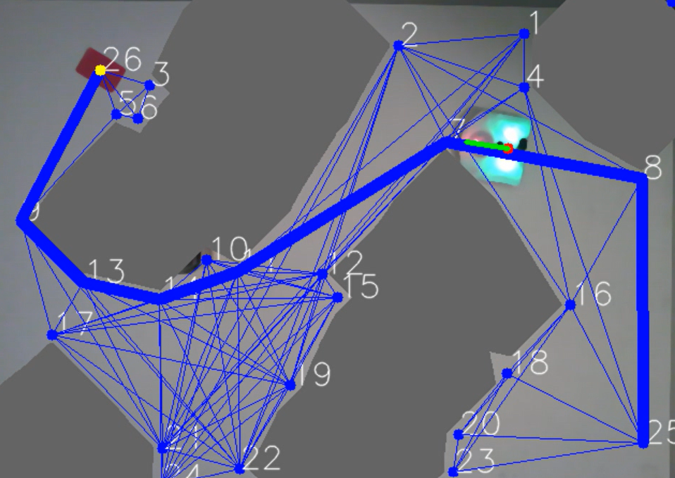

# Hot-Wheels - Thymio Path Finder Project (Mobile Robotics) 
##### _The best vision based path findind program for Thymio_
***

## Abstract

 This project is part of the course Basics of mobile robotics (ME-452). The goal is to create a software enabling the Thymio to find its path through a set of obstacles. To this end, it will need to localize itself as well as its environment, and find the best path to the goal to then drive to it. Another challenge is for it to avoid any unexpected object it meets. This project is thus split in four distinct modules, plus the main file. Those four modules are: 

- <b>Vision</b>, camera based function and transformation for position, goal and terrain exctraction
- <b>Kalman Filter</b>, sensor fusion for accurate odometry computation
- <b>Optimal path algorithm</b>, path optimization using Dijkstra
- <b>Motion control</b>, in charge of the Thymio's motion and local avoidance

